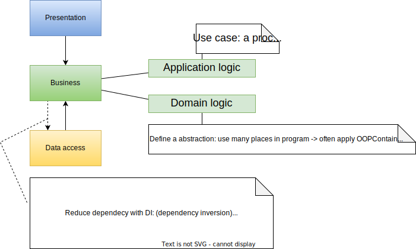
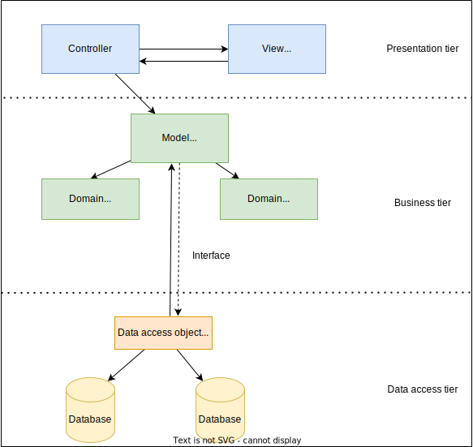
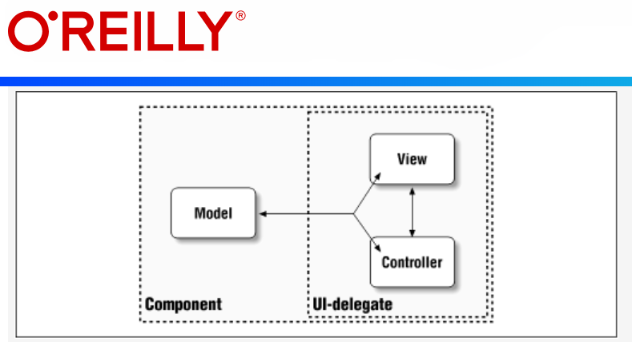
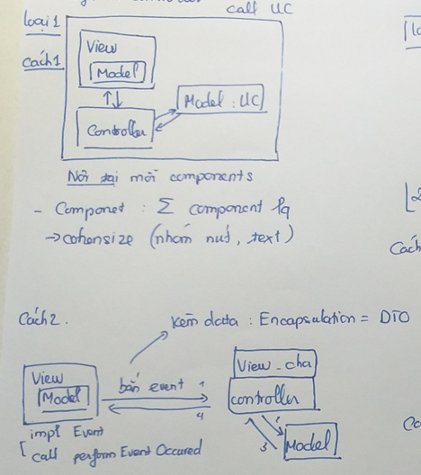
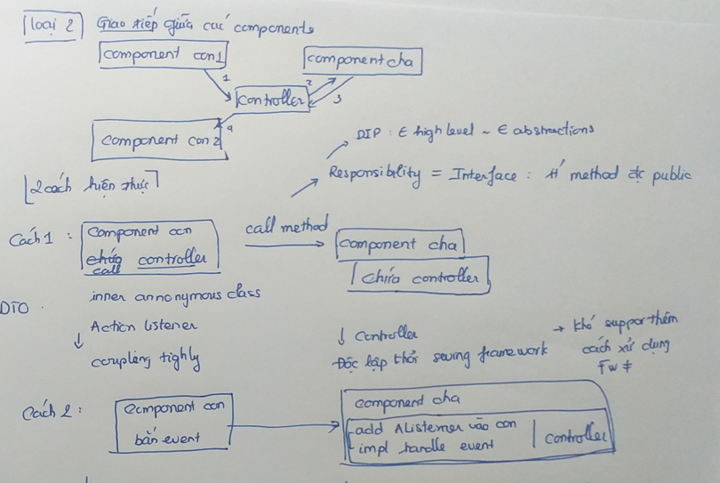

# MVC pattern  

### MVC là gì
- Model–view–controller (MVC) là một mẫu thiết kế phần mềm phổ biến được dùng cho lập trình giao diện người dùng,  
**Chia những logic** chương trình thành 3 phần kết nối liên tiếp, gồm:  

1. **Model**: chứa data, content hay logic xử lý của application  
2. **View**: gồm logic present – interact và format data (DTO)  
3. **Controller**: quản lý giao tiếp giữa model và view, giống như chứa một kịch bản cụ thể cho model và view:  

      a.Lấy request data trên view  
      b.Convert request data  
      c.Call Model (call use case) truyền vào request data  
      d.Nhận response từ model, convert response data  
      e.Return response data cho view   
- Được đưa ra bởi Trygve Reenskaug năm 1979 (Model – view – controller (MVC) pattern for graphical user interface (GUI) software design.)

### MVC trong 3 tier architecture

#### 3 tier architecture: một chuẩn chia logic và sắp xếp code
1.	**Presentation layer**
2.	**Business layer**:
      a.	Application logic: use case
      b.	Domain logic: gồm những định nghĩa, đối tượng được trừu tượng hóa, có thể dùng chung cho nhiều use case, chứa những nguyên tắc (rules) không thay đổi giữa các application khác nhau, chứa business logic
3.	**Data access layer**

Tương tác giữa các tầng: 

Presentation layer apply MVC pattern:   (giả định) 

#### Ứng dụng MVC trong swing   

##### MVC nội tại mỗi component trong swing  

  
Model có 2 loại:  
- application data: data liên quan đến logic của app, có thể định lượng  
- GUI data  
=> Biết để ta có cách thức phù hợp tương tác với các loại component

##### Presentation apply MVC in swing  

Ngoài ra, còn có các data transfer object khác.

##### Logic with controller:

###### Loại 1: Call use case

###### Loại 2: communicate giữa các components

So sánh:  
Cách 1:  
- Chỉ cần view đơn giản, phù hợp với logic trên presentation

Cách 2:
- Ngày càng giảm flexible vì code ngày càng lớn

Note:  
Bản thân mỗi compoment (View) -> thể hiện tính cohensive   
Vì nhóm các component con liên quan ở gần nhau

### Tổng kết và ứng dụng
- Mặc dù, mô hình có nhiều phần nhưng không phải lúc nào cũng cần tách class để thể hiện chúng thuộc các phần khác nhau.  
- Quan trọng là mình nhận định được logic nào ở đâu 
Để đến khi logic đủ phức tạp và mình cần viết test thì mình sẽ tách nó ra
- Thực tế, sống là linh hoạt, không phải lúc nào cũng là công thức
Quan trọng là phù hợp
- Chiêu thức là chết, con người là sống.

