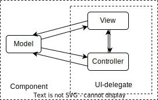
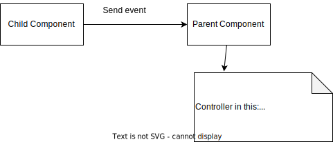

# MVC pattern  

### MVC là gì
- Model–view–controller (MVC) là một mẫu thiết kế phần mềm phổ biến được dùng cho lập trình giao diện người dùng,  
**Chia những logic** chương trình thành 3 phần kết nối liên tiếp, gồm:  

1. **Model**: chứa data, content hay logic xử lý của application  
2. **View**: gồm logic present – interact và format data (DTO)  
3. **Controller**: quản lý giao tiếp giữa model và view, giống như chứa một kịch bản cụ thể cho model và view:  

      a.Lấy request data trên view  
      b.Convert request data  
      c.Call Model (call use case) truyền vào request data  
      d.Nhận response từ model, convert response data  
      e.Return response data cho view   
- Được đưa ra bởi Trygve Reenskaug năm 1979 (Model – view – controller (MVC) pattern for graphical user interface (GUI) software design.)

### MVC trong 3 tier architecture

#### 3 tier architecture: một chuẩn chia logic và sắp xếp code
1.	**Presentation layer**
2.	**Business layer**:
      a.	Application logic: use case
      b.	Domain logic: gồm những định nghĩa, đối tượng được trừu tượng hóa, có thể dùng chung cho nhiều use case, chứa những nguyên tắc (rules) không thay đổi giữa các application khác nhau, chứa business logic
3.	**Data access layer**

Tương tác giữa các tầng:   

Presentation layer apply MVC pattern:   (giả định)    

#### Ứng dụng MVC trong swing   

##### MVC nội tại mỗi component trong swing  

  

Model có 2 loại:  
- application data: data liên quan đến logic của app, có thể định lượng  
- GUI data  
=> Biết để ta có cách thức phù hợp tương tác với các loại component

##### Presentation apply MVC in swing  

Ngoài ra, còn có các data transfer object khác.

##### Logic with controller:

###### Loại 1: Call use case, có 2 cách:  
Cách 1: Nội tại component call use của nó  

Ví dụ:

    public class View {
    View(){
    JFrame frame = new JFrame("CallUseCase Example");
    JButton button = new JButton("Click Me");

        //Controller
        ActionListener actionListener = new ActionListener() {
            @Override
            public void actionPerformed(ActionEvent e) {
                // call Model
                UseCasePrintConsole model = new UseCasePrintConsole();
                model.sayHi();
            }
        };

        // Add the ActionListener to the button
        button.addActionListener(actionListener);

        // Set up the frame
        frame.setDefaultCloseOperation(JFrame.EXIT_ON_CLOSE);
        frame.getContentPane().add(button);
        frame.setSize(300, 200);
        frame.setVisible(true);
        }
    
        public static void main(String[] args) {
            new View();
        }
    
        class UseCasePrintConsole{
            public void sayHi(){
                System.out.println("Hi");
            }
        }
    }

Cách 2: call use case thông qua class cha  

Compare:

|      | Cách 1     | Cách 2 |  
| ------ | ----------- | ------------ | 
|  Lợi | Cohensive tốt hơn, vì use case của class con thì để class con biết và gọi | Đơn giản hóa View |  
| Hại  | Mất đi tính đơn giản của view là chỉ chứa logic GUI và hiển thị  | Nếu use case của class con ngày càng nhiều thì class controller của cha càng phức tạp  |  

###### Loại 2: communicate giữa các components
Tổng quan    
  

**Cách 1**: Communicate by call method   
  
**Cách 2**:  
  

Compare:

|      | Cách 1                                                                 | Cách 2                                                           |  
| ---- |------------------------------------------------------------------------|------------------------------------------------------------------| 
|  Lợi | Controller của class cha độc lập khỏi swing framework                  | Đơn giản hóa View                                                |  
| Hại  | Tight coupling, khó support nếu muốn sử dụng cách khác swing framework | Controller phụ thuộc vào swing và có thể càng ngày càng phìn ra  |  

Note:  
Bản thân mỗi compoment (View) -> thể hiện tính cohensive   
Vì nhóm các component con liên quan ở gần nhau

### Tổng kết và ứng dụng

#### Vậy MVC mang lại gì cho ta?  
Đạt được các tiêu chí code  
- Maintainability (Dễ bảo trì): 1 class lớp chứa cả View, Model, Controller mình có thể tách thành 3 phần -> code giảm độ phức tạp, tăng tính dễ hiểu
- Reusability (Tính tái sử dụng): những logic chia nhỏ thành các phần, dễ tái sử dụng ví dụ như component con, model (use case)
- Extendability (Tính mở rộng): mình có thể tạo động phần sinh ra view như JTable, nhưng sẽ làm phức tạp hóa code

### Vậy đạt được tiêu chí code tốt để làm gì?
- Để lập trình dễ dàng hơn
- Mục đích hơn cả là release product nhanh hơn và thích ứng được với requirement linh động của thị trường, cái mà thay đổi theo từng giai đoạn, vòng đời khác nhau  

### Ứng dụng: Sống là động
- Mặc dù, mô hình có nhiều phần nhưng không phải lúc nào cũng cần tách class để thể hiện chúng thuộc các phần khác nhau.  
Vì như thế sẽ tự mình làm rối mình không cần thiết.  
- Quan trọng là mình nhận định được logic nào ở đâu   
Để đến khi logic đủ phức tạp và mình cần viết test thì mình sẽ tách nó ra
- Thực tế, sống là linh hoạt, không phải lúc nào cũng là công thức  
Quan trọng là phù hợp.
- Cũng giống như chiêu thức là chết, con người là sống.

